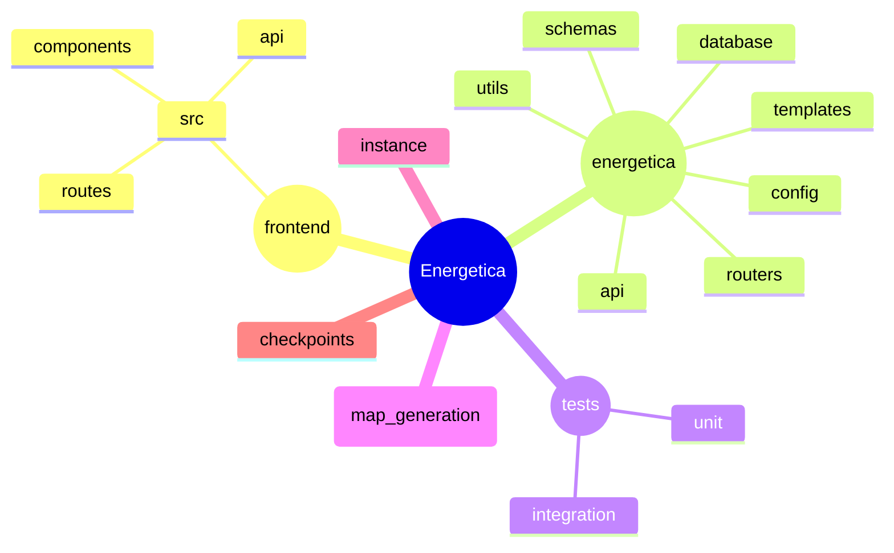
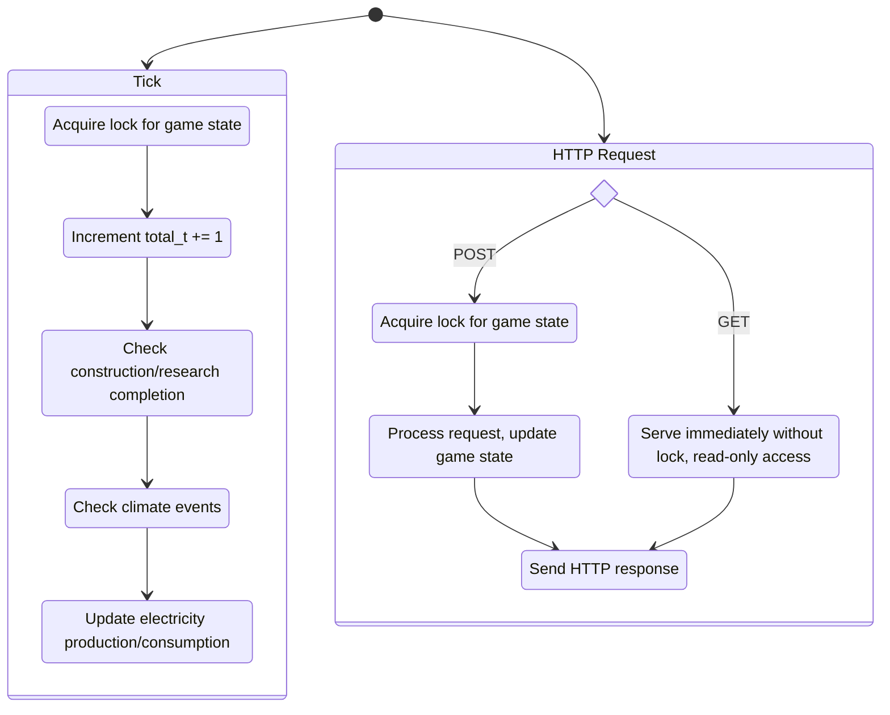
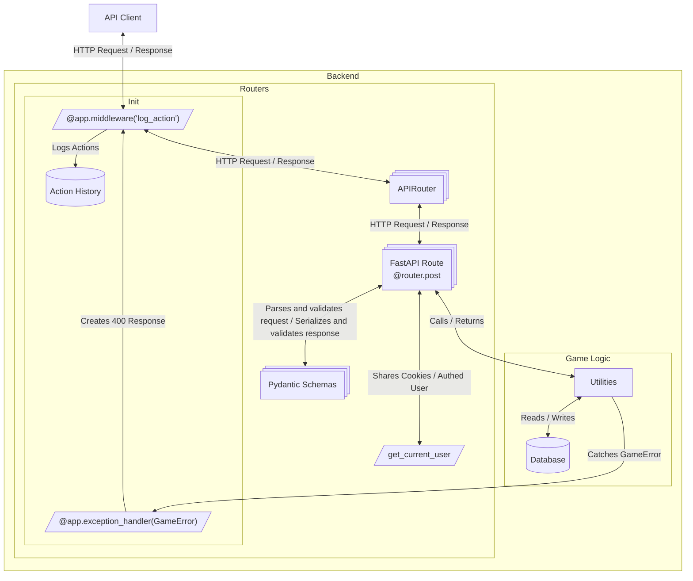

# Energetica Architecture

## Project file structure

* The backend is built using FastAPI, and resides in the `energetica` directory.
* Tests for the backend are located in the `tests` directory.
* The frontend is a separate React application, located in the `frontend` directory.
* The `instance` and `checkpoints` directories store the current save and are not versioned.
* The `map_generation` directory contains code related to generating maps for the game.

## Python Backend Overview

### FastAPI Framework

* The main `FastAPI` app is created in `energetica/__init__.py`
* Routes are located in `energetica/routers/`
* Pydantic models for request validation and response serialization are located in `energetica/schemas/`

### Custom In-Memory Database
A custom in-memory database is used to store the game's runtime state. The rationale is there are frequent writes for each game tick. It is periodically persisted to disk in the `instance/` directory. This is done by the `GameEngine`'s `save` method. The `instance/` folder is periodically backed up to the `checkpoints/` folder.

### Top-Level Components
| Component | Purpose |
|----------|---------|
| `main.py` & `energetica/__init__.py` | Bootstrap: parse flags, configure FastAPI app, start tick loop with schedulers |
| `energetica/game_engine.py` | Store engine configuration, hold all game objects in  RAM |
| `energetica/database/` | All classes who's state is persisted |
| `energetica/production_update.py` | Tick logic, power production & consumption logic, market logic |
| `energetica/technology_effects.py` | Tech modifiers (efficiency, production, emissions) |
| `energetica/utils/` | Utility functions and helpers |
| `energetica/socketio.py` | Real‑time push (progress updates, player state) |
| `energetica/routers/` | HTTP endpoints / services |
| `energetica/schemas/` | Pydantic models for request validation and response serialization |
| `energetica/templates/` | Jinja2 templates for rendering HTML responses, legacy |

## Game Loop: Tick Execution

### Tick Scheduling
By default, ticks are scheduled to happen every minute, on the minute. This is controlled by the `--clock_time` flag. The `create_app` function in `__init__.py` sets up the tick scheduler, using the `apscheduler` library.

### Tick Execution Steps
1. The `total_t` counter is incremented.
2. Database is checked for completion of projects and shipments.
3. Climate events are ran, with deterministic randomness.
4. Production update recalculates generation, storage charge/discharge, consumption.

### Locking Mechanism

The game engine ensures state consistency with a lock. Write operations (e.g., ticks, POST, PUT, PATCH, and DELETE requests) acquire the lock, while read-only requests (e.g., GET) bypass it.

### Error Handling
- Domain errors: custom [`GameError`](energetica/game_error.py) exception (e.g. `NOT_ENOUGH_MONEY`, `FACILITY_NOT_UPGRADABLE`).
- When raised in an API call, these are automatically converted to HTTP responses with `400` status codes.
- Validate player actions early (API layer) with Pydantic schemas.

## API Flow

There are multiple components involved in processing an API request. Largely this is a standard FastAPI flow, with middleware, routers, and schemas working together to handle requests and responses. Of note is the custom middleware for logging actions, and the error handling middleware.

<!-- TODO: Diagram - Application Startup & Configuration Flow
     Show flow of how command line args are parsed, configuration is loaded, and the tick loop + API server are started.
-->

---
See also: [CONTRIBUTING.md](CONTRIBUTING.md), [STYLEGUIDE.md](STYLEGUIDE.md).
