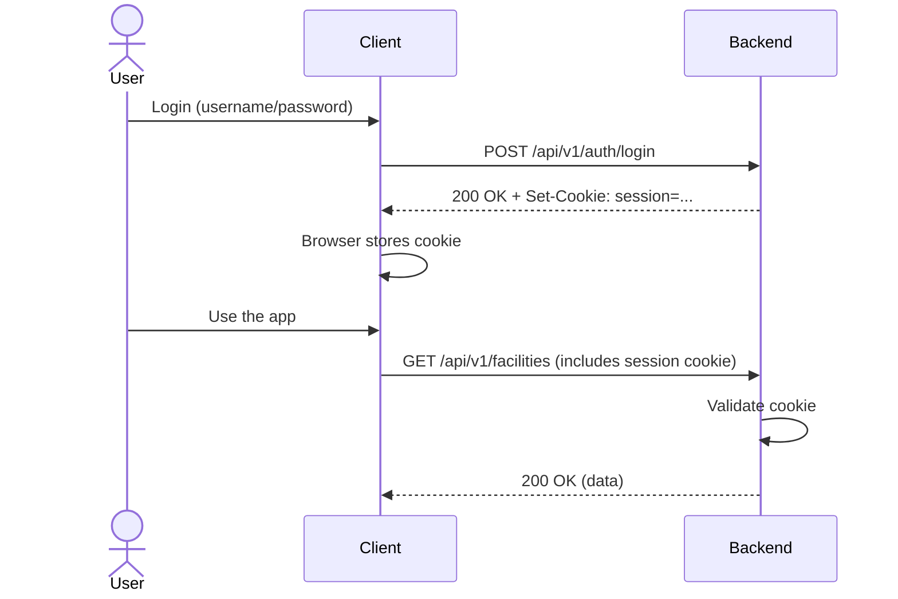

# Authentication

Energetica uses cookie-based session authentication. All API endpoints are RESTful—pass your session cookie along and you're authenticated.

## How It Works



## Using the API

To authenticate via API:

1. **Login** - `POST /api/v1/auth/login`

    - Send: `{"username": "...", "password": "..."}`
    - Get back: `Set-Cookie: session=<token>`

2. **Use the cookie** - Include it in all subsequent requests

    - Browsers do this automatically
    - API clients: set `credentials: "include"` (fetch) or similar

3. **Check auth** - `GET /api/v1/auth/me`
    - Returns current user if authenticated
    - Returns 401 if not

## Backend Implementation

**Entry point:** `energetica/routers/auth.py`

-   `POST /auth/login` - Validates credentials, sets session cookie
-   `GET /auth/me` - Returns current user
-   `POST /auth/signup` - Creates new account
-   `POST /auth/change-password` - Changes password

**Session management:** `energetica/utils/auth.py`

-   `add_session_cookie_to_response()` - Sets the session cookie on responses
-   `get_user()` - Retrieves user from session cookie
-   Session tokens are signed using `itsdangerous` serializer

**Middleware:** `energetica/routers/__init__.py`

-   Unauthenticated GET requests that return 401 are redirected to `/app/login`
-   POST/PUT/PATCH/DELETE requests require authentication (enforced per-endpoint)

**Authentication enforcement:** Endpoints use FastAPI `Depends()` to require authentication:

```
get_user()              - Returns User or None
get_playing_user()      - Requires authenticated user with "player" role
get_settled_player()    - Requires authenticated player who has chosen location
```

## Frontend Implementation

**Auth state:** `frontend/src/contexts/AuthContext.tsx`

-   Manages global auth state (user, isAuthenticated, isLoading)
-   Fetches `/auth/me` on app startup
-   Handles 401 errors gracefully (user not authenticated)

**Auth hook:** `frontend/src/hooks/useAuth.ts`

-   Provides `user`, `isAuthenticated`, `isLoading`, `refetch()`, `logout()`
-   Must be used within `AuthProvider`

**Protected routes:** `frontend/src/components/auth/ProtectedRoute.tsx`

-   `ProtectedRoute` - Requires authentication, redirects to `/app/login` if not
-   `RequireSettledPlayer` - Requires authenticated player who has settled, redirects to `/app/settle` if not

**API client:** `frontend/src/lib/api-client.ts`

-   Automatically includes cookies with all requests (`credentials: "include"`)

## Reverse Proxy / Deployment

When deployed behind a reverse proxy (e.g., Apache with SSL termination):

-   The frontend receives HTTPS but backend receives HTTP from the proxy
-   Backend checks the `X-Forwarded-Proto: https` header to determine if SSL is active upstream
-   Session cookie is set with `secure=true` only when `X-Forwarded-Proto: https` is present
-   This allows the same code to work in dev (HTTP) and production (HTTPS behind proxy)

See `energetica/utils/auth.py:add_session_cookie_to_response()` for implementation.
