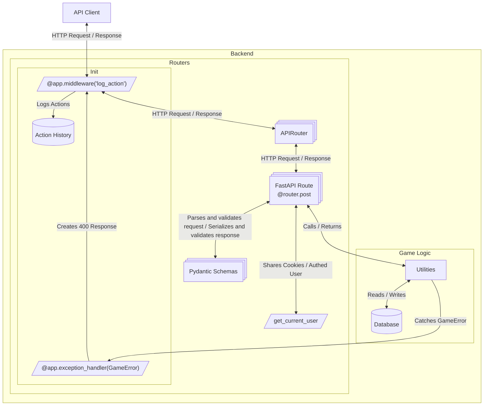

# Overview of API

APIs are defined in the backed using FastAPI + Pydantic. See `<URL>/docs` for Swagger docs and `<URL>/openapi.json` for an OpenAPI compliant definition of the HTTP APIs. On the frontend, requests are managed by Tanstack Query. The openapi json file is used to automatically generate typescript types for the frontend. Furthermore, since data regularly becomes stale, invalidation messages are sent using Socket.IO. See the socketio.md for more details.

Note that there is an intention for players to be able to use the API themselves directly. Hence swagger.

## Backend patterns

See routers/ see schemas/
See middleware, it does logging mechanism + checks auth
In a route, you have `depends` to get a player and the middleware does the checks. There's a specific file where that's defined.
See auth.md

## Frontend patterns

See the package json script for generating types. It's the .generated file. See frontend/src/types. See hooks.

See api_integration for more details.

## Error handling

see the dedicated file about this

## API Flow

This below is very complicated. Once the above is fleshed out, this can be simplified or removed.

There are multiple components involved in processing an API request. Largely this is a standard FastAPI flow, with middleware, routers, and schemas working together to handle requests and responses. Of note is the custom middleware for logging actions, and the error handling middleware.

### Other

API use AIP-136 style syntax, .i.e. POST requests with a verb, e.g. in energetica/routers/resource_market.py:
