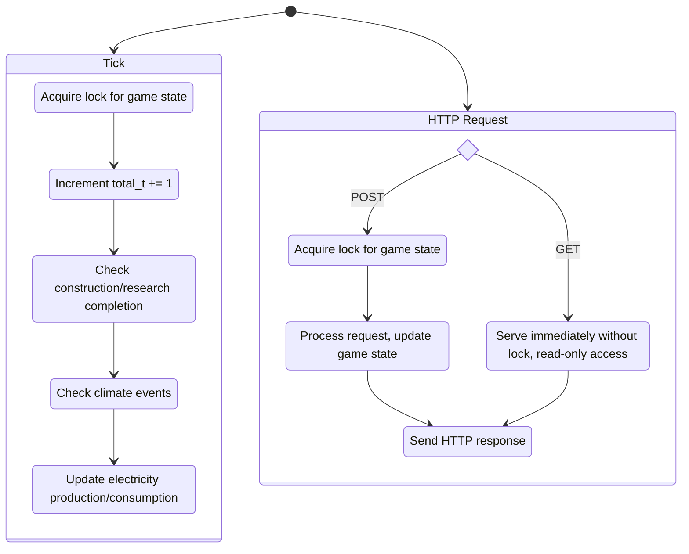

# Game Loop: Tick Execution

## Tick Scheduling

By default, ticks are scheduled to happen every minute, on the minute. This is controlled by the `--clock_time` flag. The `create_app` function in `__init__.py` sets up the tick scheduler, using the `apscheduler` library.

## Tick Execution Steps

1. The `total_t` counter is incremented.
2. Database is checked for completion of projects and shipments.
3. Climate events are ran, with deterministic randomness.
4. Production update recalculates generation, storage charge/discharge, consumption.

## Locking Mechanism

The game engine ensures state consistency with a lock. Write operations (e.g., ticks, POST, PUT, PATCH, and DELETE requests) acquire the lock, while read-only requests (e.g., GET) bypass it.

## Error Handling

-   Domain errors: custom [`GameError`](/energetica/game_error.py) exception (e.g. `NOT_ENOUGH_MONEY`, `FACILITY_NOT_UPGRADABLE`).
-   When raised in an API call, these are automatically converted to HTTP responses with `400` status codes.
-   Validate player actions early (API layer) with Pydantic schemas.

See also the middleware - this catches game errors when these happen during an API call

<!-- TODO: Diagram - Application Startup & Configuration Flow
     Show flow of how command line args are parsed, configuration is loaded, and the tick loop + API server are started.
-->
