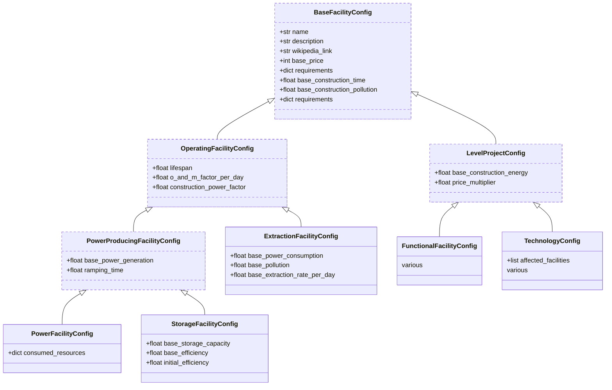

# Configuration for Game Values

## Config Files

Game values are stored in configuration files as YAML. These can be found in the
`config/` directory. The files contained are structured named as follows:

-   `config/power-facilities.yaml`
-   `config/storage-facilities.yaml`
-   `config/extraction-facilities.yaml`
-   `config/functional-facilities.yaml`
-   `config/technologies.yaml`

## Config Models

The YAML files are loaded into memory at startup, when the main `GameEngine`
object is initialised. These conform to pydantic models, which are located in
the `energetica/config/` module.

These models are used to validate that the YAML config files are correctly
structured. This includes verifying that values are non-negative, or that some
multipliers are in the interval of zero to one exclusive, for example.

The validation rules are also exported to JSON schemas. The
`save_config_schemas.py` is responsible for generating these JSON schemas.
These are used by the `redhat.vscode-yaml` extension within VSCode to give IDE
validation. The JSON schemas are exported to the `energetica/schemas/config`
directory.

### Config Models Hierarchy

<!-- classDef final stroke:#cc,stroke-width:3px,stroke-dasharray: 5 2; -->
