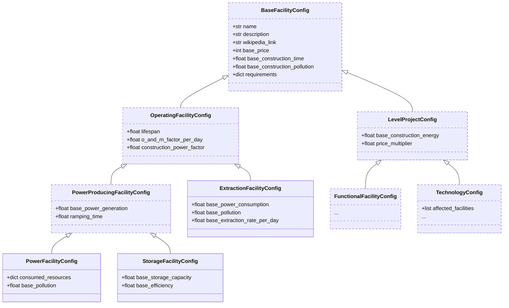

# Configuration for Game Values

## Config Files

Game values are stored in configuration files as JSON and YAML. These can be
found in the `config/` directory. The config files are loaded into memory at
startup, when the main `GameEngine` object is initialised.

The files contained are structured named as follows:

-   `config/power-facilities.yaml`
-   `config/storage-facilities.yaml`
-   `config/extraction-facilities.yaml`
-   `config/functional-facilities.yaml`
-   `config/technologies.yaml`
-   `config/seasonal-river-discharge.json`
-   `config/wind-power-curve.json`

## Pydantic Models

The pydantic models are located in the `energetica/schemas/config/` module.
These ensure correct validation of the config files on startup.
For example, verifying that values are non-negative, or that appropriate
multipliers are in specific numeric intervals.

## IDE Validation

The validation rules are also exported to JSON schemas. The
`./save_config_schemas.py` module is responsible for generating these.
The `redhat.vscode-yaml` extension for VSCode can then offer in IDE validation.
The JSON schemas are exported to the `./config-schemas` directory.

### Hierarchy for Project Models

below, concrete models have a solid border, abstract models have a dashed border.

