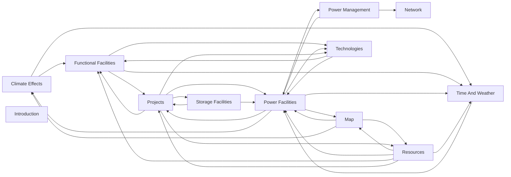
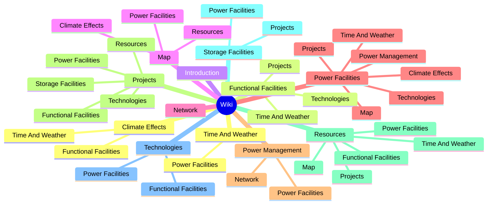

# Wiki Link Check

**Server:** http://localhost:5173
**Result:** All 30 links OK ✓

## Link Check

| | Status | Link | Source |
|---|---|---|---|
| ✓ | `route` | /app/overviews/emissions | climate-effects |
| ✓ | `skip` | #heatwave | climate-effects |
| ✓ | `file` | ./functional-facilities.mdx#carbon-capture | climate-effects |
| ✓ | `route` | /app/community/map | climate-effects, map |
| ✓ | `file` | ./time-and-weather.mdx#game-time | climate-effects, functional-facilities, power-facilities, resources |
| ✓ | `200` | /static/images/wiki/heatwave_probability_distribution.png | climate-effects |
| ✓ | `200` | /static/images/wiki/coldwave_probability_distribution.png | climate-effects |
| ✓ | `200` | /static/images/wiki/wildfire_probability_distribution.png | climate-effects |
| ✓ | `200` | /static/images/wiki/expected_occurrence_flood.jpg | climate-effects |
| ✓ | `200` | /static/images/wiki/expected_occurrence_hurricane.jpg | climate-effects |
| ✓ | `file` | ./projects.mdx#starting-a-project | functional-facilities, power-facilities, resources, storage-facilities |
| ✓ | `route` | /app/facilities/functional | functional-facilities, projects |
| ✓ | `file` | ./technologies.mdx | functional-facilities, power-facilities, projects |
| ✓ | `file` | ./power-facilities.mdx#solar-power-generation | map, time-and-weather |
| ✓ | `file` | ./resources.mdx#extraction-facilities | map, projects |
| ✓ | `file` | ./climate-effects.mdx#climate-events | map |
| ✓ | `route` | /app/community/electricity-markets | network, power-management |
| ✓ | `route` | /app/dashboard | power-facilities, projects, time-and-weather |
| ✓ | `file` | ./map.mdx#wind-potential | power-facilities |
| ✓ | `file` | ./power-management.mdx | power-facilities |
| ✓ | `route` | /app/facilities/technology#thermodynamics | power-facilities |
| ✓ | `file` | ./network.mdx | power-management |
| ✓ | `route` | /app/facilities/manage | projects |
| ✓ | `route` | /app/overviews/cash-flow | projects |
| ✓ | `file` | ./storage-facilities.mdx | projects |
| ✓ | `route` | /app/facilities/power | projects |
| ✓ | `route` | /app/facilities/storage | projects |
| ✓ | `route` | /app/facilities/extraction | projects |
| ✓ | `route` | /app/community/resource-market | projects |
| ✓ | `route` | /app/overviews/resources | resources |

## Flowchart

## Mindmap

